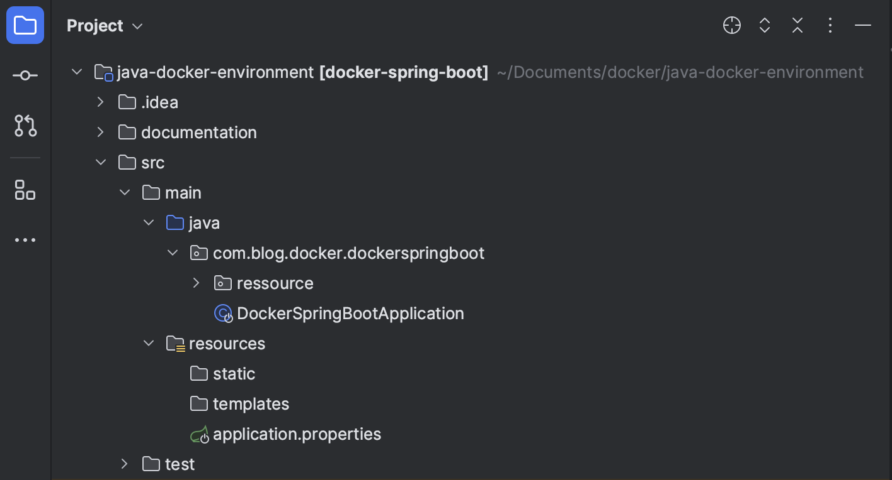
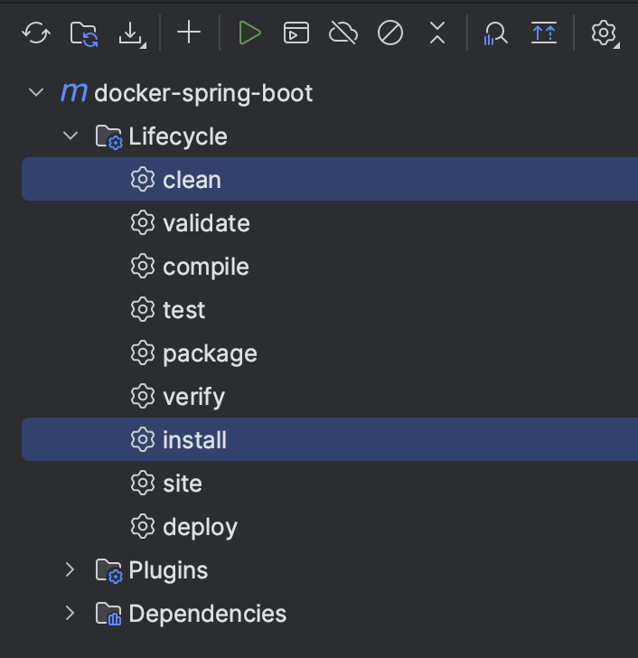
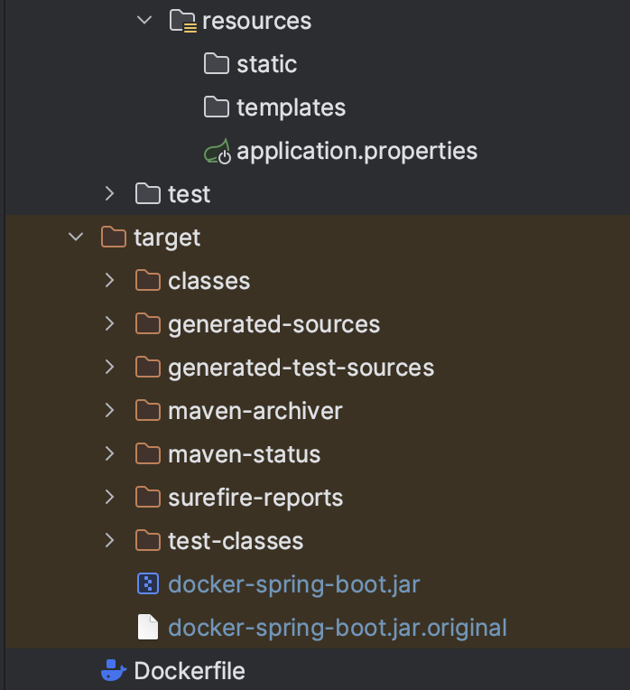

# java_docker_environment
### Create a basic java docker environement, working with springboot/maven made with intellij IDEA.

----
###  **Start a new Spring Boot project:**

* **What is Springboot**

  * `Java Spring Framework` (Spring Framework) is a popular, **open source, enterprise-level framework** for creating standalone, 
  production-grade applications that run on the Java Virtual Machine (JVM).
   
  >`Java Spring Boot `(Spring Boot) is a tool that makes **developing web application** and **microservices with Spring Framework** 
  **faster** and **easier** through three **core capabilities**:

      1. Autoconfiguration
      2. An opinionated approach to configuration
      3. The ability to create standalone applications

  * These features work together to provide you with a tool that allows you to set up a Spring-based application with 
minimal configuration and setup.

* **Follow the step** show in this tutorial https://spring.io/quickstart.
  * For `spring initializr` my configuration is as followed:
    > Project: **Maven**
    > 
    > Language: **Java**
    > 
    > Spring Boot: **3.1.9 (SNAPSHOT)**
    > 
    > Packaging: **jar**
    > 
    > Java: **17**
    > 
    > **You must add** the web dependency: `Spring Web` 

[//]: # (  * It will provide a zip file, it will become you project repository.)

---
###  **Build your new Maven Project:**

* Now your project should look like this (without the ressource repository):

    >
* Create a `resource` repository and a class file in it, i call it `HelloRessource`, mine displays "Hello World". 
Be free to add what do you want in this class.

* Now you need to build the new project using the Maven tools provided by the intelliJ IDE, which should look like this:

  >
  > 
  > * Select `clean` and `install` and run the installation with the `play logo`, it will build the new project.

---
###  **Create the dockerfile:**

* **If you don't know how work** `docker` or what is a `Dockerfile`, check the website from [docker](https://docs.docker.com/get-started/overview/).

* Now we will create our `Dockerfile`, you will need the jar file from your target repository, it's look like this:
  >
  > 
  > **Warning**, The name of the jar file is longer originally, you can modify the name in the `pom.xml`, 
  > line: **pom.xml:36**.
  > 
  > If you don't have the jar file in your target repository you may forget to select the Snapshot version of springboot. 
* I chose `openjdk:23` to **define the base image** to use to start the build process, 
**because it was the latest version at the time**.

* I copy the jar file into my container.

* I'm **exposing** the `port 8085` for the browser, **springboot has a default port** who's the `port 8080`, if you want to change it,
  
  * open `src/main/resources/application.properties` and add `server.port=8085`

### and now enjoy you java docker environment.
